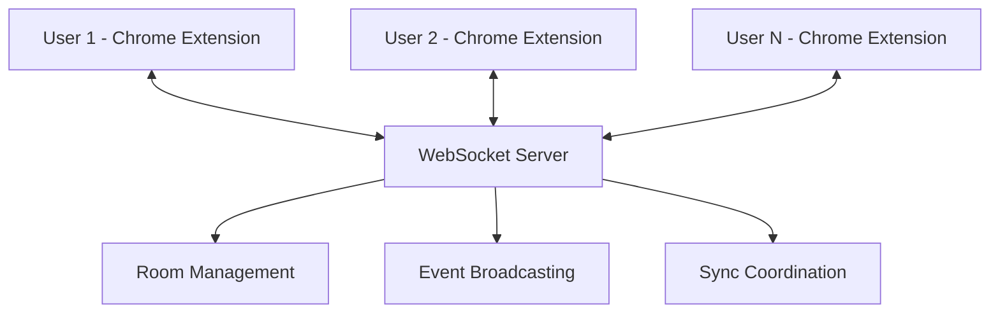

# WatchSync 🎬

A **free, open-source alternative to Teleparty** that lets you watch videos together with friends in perfect sync. Built as a Chrome extension with real-time synchronization across Netflix, YouTube, Hotstar, and more streaming platforms.

## ✨ Features

- **🎯 Real-time Sync**: Play, pause, and seek events are instantly synchronized across all participants
- **🌍 Universal Platform Support**: Works on Netflix, YouTube, Disney+ Hotstar, Hulu, Prime Video, and more
- **👥 Equal Control**: No host required - everyone can control playback
- **🔒 Privacy Focused**: No data collection, completely open source
- **⚡ Lightweight**: Minimal resource usage with efficient WebSocket communication
- **🕶️ Incognito Support**: Works seamlessly in both regular and incognito windows

## 🚀 Quick Start

### Prerequisites
- **Node.js** (v16 or higher)
- **Chrome Browser**

### 1. Server Setup
```bash
# Clone the repository
git clone https://github.com/nikhilpathiyil/watchsync.git
cd watchsync

# Install server dependencies
cd server
npm install

# Start the WebSocket server
npm start
```

The server will run on `http://localhost:3001`

### 2. Extension Installation

1. **Download the extension**: Clone this repo or download the `extension/` folder
2. **Open Chrome**: Go to `chrome://extensions/`
3. **Enable Developer Mode**: Toggle the switch in the top right
4. **Load Extension**: Click "Load unpacked" and select the `extension/` folder
5. **Grant Permissions**: The extension will request access to video sites

### 3. Start Watching Together!

1. **Open a video** on any supported platform (Netflix, YouTube, Hotstar, etc.)
2. **Click the WatchSync icon** in your browser toolbar
3. **Create a room** or **join an existing room** with a room ID
4. **Share the room ID** with friends
5. **Enjoy synchronized watching!** 🍿

## 🎮 How It Works



1. **Video Detection**: Extension automatically detects HTML5 video elements on streaming sites
2. **Event Capture**: Captures play, pause, and seek events from video players
3. **Real-time Sync**: WebSocket server broadcasts events to all room participants
4. **Cross-platform**: Universal approach works across different streaming platforms

## 🧪 Testing Multi-User Sync

For local testing, you can simulate multiple users:

### Method 1: Regular + Incognito Windows
1. **Regular window**: Create a room
2. **Incognito window** (Ctrl+Shift+N): Join the same room
3. Test sync between the two windows

### Method 2: Different Browser Profiles
1. Create multiple Chrome profiles
2. Install the extension in each profile
3. Join the same room from different profiles

### Method 3: Different Devices
1. Install on multiple devices on the same network
2. Ensure server is accessible (`http://[your-ip]:3001`)
3. Join the same room from different devices

## 🛠️ Development

### Project Structure
```
watchsync/
├── extension/           # Chrome extension files
│   ├── manifest.json   # Extension configuration
│   ├── watchsync-content.js    # Content script (injected into web pages)
│   ├── watchsync-background.js # Background service worker
│   └── popup/          # Extension popup UI
├── server/             # WebSocket server
│   ├── index.js        # Server implementation
│   └── package.json    # Server dependencies
├── testing/            # Testing utilities and guides
└── docs/              # Documentation
```

### Key Technologies
- **Chrome Extension API** (Manifest V3)
- **WebSockets** for real-time communication
- **Node.js + Express** for the server
- **HTML5 Video API** for universal video control

### Supported Platforms
- ✅ **YouTube** (`youtube.com`)
- ✅ **Netflix** (`netflix.com`)
- ✅ **Disney+ Hotstar** (`hotstar.com`)
- ✅ **Hulu** (`hulu.com`)
- ✅ **Prime Video** (`primevideo.com`)
- ✅ **Local testing** (`localhost`)

## 🐛 Troubleshooting

### Extension Issues
- **Video not detected**: Refresh the page and check if the site is supported
- **Popup shows "Unknown"**: Wait a few seconds for video detection to complete
- **Events not syncing**: Ensure WebSocket server is running on port 3001

### Connection Issues
- **"Disconnected" status**: Check if server is running (`npm start` in `/server`)
- **Can't join rooms**: Ensure both users are connected to the same server
- **Firewall issues**: Make sure port 3001 is accessible

### Incognito Mode
- Extension automatically works in incognito mode with separate sessions
- Each window (regular/incognito) maintains independent storage and user IDs

## 🤝 Contributing

We welcome contributions! This project was built as a free alternative to paid sync solutions.

### Development Setup
1. Fork the repository
2. Clone your fork: `git clone https://github.com/yourusername/watchsync.git`
3. Install dependencies: `cd server && npm install`
4. Make your changes
5. Test thoroughly with the extension
6. Submit a pull request

### Adding New Platforms
To add support for a new streaming platform:
1. Add platform config in `extension/watchsync-content.js` - `PLATFORM_CONFIGS`
2. Update `manifest.json` with new host permissions
3. Test video detection and sync functionality

## 📝 License

MIT License - feel free to use, modify, and distribute!

## 🙏 Acknowledgments

Built as a free, open-source alternative to Teleparty. Special focus on Hotstar support which is often locked behind premium features in other solutions.

## 📞 Support

- **Issues**: [GitHub Issues](https://github.com/nikhilpathiyil/watchsync/issues)
- **Discussions**: [GitHub Discussions](https://github.com/nikhilpathiyil/watchsync/discussions)

---

**Made with ❤️ for seamless shared viewing experiences**